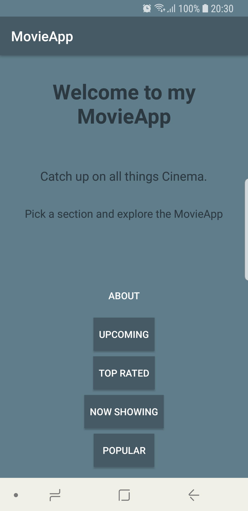
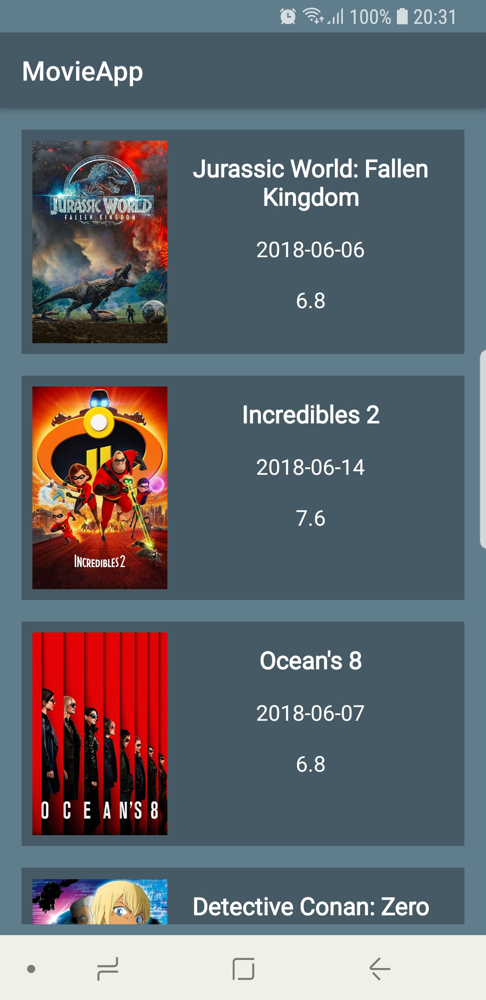
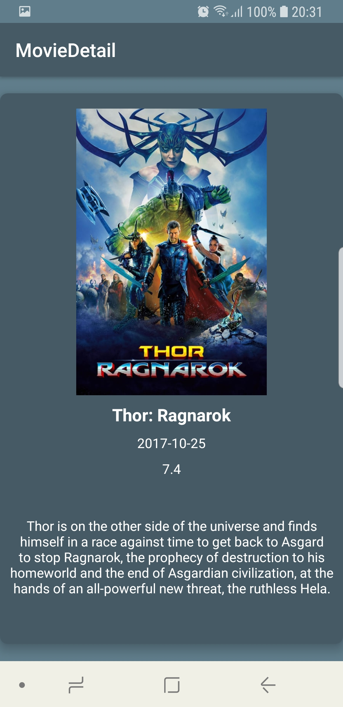
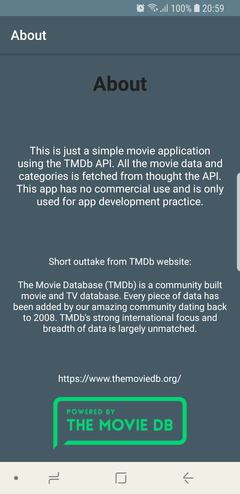

# Simple MovieApp using TheMovieDb

This is an Android demo application displaying popular, top rated, now showing and upcoming movies using [TheMovieDb API](https://www.themoviedb.org/documentation/api).

The app pulls JSON data from the TheMovieDb API using a AsyncHTTPclient, then parses the raw data and displays the results in a RecyclerView, using Constraint layouts with a CardView to display the idividual movie results on screen.

**Sample screenshots from app**

   

**Libraries:**

* Android AsyncHTTPClient
* Picasso
* Recycler View
* Constraint layouts

**Note:** 

As in the current state the app will not run successfully, since the API key that was used was removed. Repacing the <<API_KEY>> placeholder with your API key will result in a successfull build.
